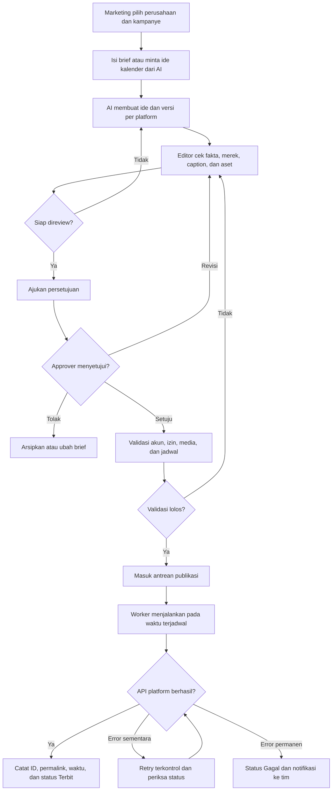
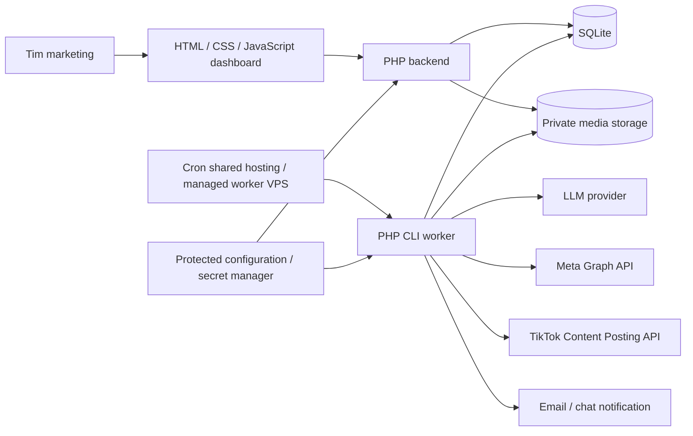

# PRD — Social Media Automation

**Status:** Draft untuk validasi  
**Versi:** 1.2  
**Tanggal:** 7 Oktober 2026  
**Pemilik produk:** Perusahaan/Marketing  
**Bahasa produk:** Indonesia  

## 1. Ringkasan

Sistem ini membantu tim marketing merencanakan, membuat, meninjau, menjadwalkan, dan mempublikasikan konten untuk tiga perusahaan melalui TikTok, Instagram, dan Facebook. Setiap konten terikat ke perusahaan, akun tujuan, platform, jadwal, aset media, dan status persetujuan yang jelas.

Perusahaan yang dikelola:

1. Signal Prima Solusi
2. Netindo Persada Nusantara
3. Mega Data Link

Target konfigurasi awal adalah hingga sembilan akun kanal: satu TikTok, satu Instagram, dan satu Facebook Page untuk setiap perusahaan. Sistem tetap mendukung lebih dari satu akun per platform/perusahaan bila nanti dibutuhkan.

AI menghasilkan ide, kalender, caption, variasi copy, hashtag, dan brief visual/video berdasarkan profil merek. AI tidak menerbitkan konten sendiri tanpa kontrol yang ditentukan perusahaan. Konten masuk ke antrean persetujuan; setelah disetujui, sistem menerbitkannya sesuai kemampuan API resmi tiap platform dan mencatat hasilnya.

**Keputusan teknologi dan deployment:** aplikasi menggunakan HTML, CSS, JavaScript, PHP, dan SQLite. Testing/UAT client dilakukan di shared hosting; production dijalankan di VPS. Kedua lingkungan memakai basis kode, schema database, dan aturan bisnis yang sama, dengan konfigurasi dan data terpisah. Python hanya ditambahkan bila ada kebutuhan spesifik yang tidak layak ditangani PHP, dan bukan prasyarat aplikasi inti. PRD harus diperbarui setiap kali improvement yang disepakati mengubah kebutuhan, perilaku, arsitektur, atau kriteria penerimaan.

## 2. Masalah yang ingin diselesaikan

- Tim harus berpindah-pindah akun dan aplikasi untuk mengelola tiga merek.
- Kalender, naskah, aset, persetujuan, dan status posting mudah tercecer.
- Konten yang sama tidak selalu cocok untuk format dan gaya tiap platform.
- Jadwal publikasi dan tindak lanjut saat gagal belum terpusat.
- Pembuatan konten berulang menyita waktu dan menyulitkan konsistensi merek.

## 3. Tujuan dan ukuran keberhasilan

### Tujuan

- Mengelola konten tiga perusahaan dari satu ruang kerja.
- Membuat kalender dan draft konten dengan bantuan AI.
- Menyediakan persetujuan manusia sebelum publikasi.
- Menjadwalkan dan menerbitkan konten per akun/platform melalui jalur resmi.
- Memberi visibilitas atas status, kegagalan, dan riwayat publikasi.

### Metrik produk

- 100% konten memiliki perusahaan, akun tujuan, pemilik, dan status.
- Minimal 90% posting terjadwal berhasil terbit atau masuk status gagal yang dapat ditindaklanjuti.
- 100% publikasi tercatat dengan waktu, platform, akun, ID posting bila tersedia, dan hasil.
- Waktu dari ide ke draft berkurang dibanding proses manual (ukur baseline pada bulan pertama).
- Tingkat revisi/penolakan draft AI dan ketepatan waktu publikasi dipantau per merek.

Angka target operasional awal dapat disesuaikan setelah baseline dan volume posting disepakati.

## 4. Bukan tujuan MVP

- Menjamin viralitas atau membuat keputusan strategi pemasaran secara otonom.
- Membalas komentar/DM, menjalankan iklan, atau mengelola komunitas.
- Mengambil/mengunggah konten melalui scraping, simulasi browser, atau penyimpanan password akun.
- Analitik lintas platform tingkat lanjut atau atribusi penjualan.
- Membuat video AI final secara otomatis tanpa proses kurasi dan pemeriksaan hak penggunaan.

## 5. Pengguna dan hak akses

| Peran | Kemampuan |
|---|---|
| Admin sistem | Mengelola pengguna, perusahaan, koneksi akun, pengaturan, dan audit log. |
| Admin perusahaan | Mengelola profil merek, akun kanal, jadwal, dan anggota untuk perusahaan yang ditugaskan. |
| Editor/Marketing | Membuat kalender, meminta draft AI, mengunggah aset, dan mengedit konten. |
| Approver | Meninjau, meminta revisi, menyetujui, atau menolak konten. Dapat ditetapkan per perusahaan. |
| Viewer/Manajemen | Melihat kalender, status publikasi, dan ringkasan performa tanpa mengubah konten. |

Hak akses dibatasi berdasarkan perusahaan dan akun yang ditugaskan. Perubahan status dan persetujuan dicatat.

### 5.1 Tahap awal: login dan pemulihan akun

- Implementasi dimulai dari halaman login, lupa kata sandi, kata sandi baru, dan logout sebelum fitur/page produk lainnya.
- Setelah login, tahap awal hanya menampilkan konfirmasi identitas akun dan tombol logout, bukan dashboard atau fitur konten yang belum tersedia.
- Tidak ada pendaftaran publik atau akun/password default. Admin sistem awal dibuat melalui CLI interaktif yang dilindungi; role dan penugasan perusahaan lainnya menyusul pada fase berikutnya.
- Login memakai email dan password hash PHP, validasi sisi server, CSRF, pembatasan percobaan, session cookie HttpOnly/SameSite/Secure pada HTTPS, serta rotasi session saat login/logout. Batas awal: 10 percobaan per email dan 30 per IP selama 15 menit; idle session 30 menit dan maksimum 8 jam.
- Kata sandi baru minimal 12 karakter dan maksimal 72 byte untuk menghindari pemotongan bcrypt. Form konfirmasi password divalidasi server; password tidak ditampilkan ulang setelah error.
- Reset memakai email dengan respons generik yang sama untuk akun aktif terdaftar maupun email tidak terdaftar. Permintaan dibatasi 3 per email dan 10 per IP selama 15 menit; melewati batas email tetap mendapat respons generik tanpa job tambahan.
- Tautan reset berisi token acak 256-bit, hanya hash token yang disimpan sebagai referensi, kedaluwarsa 30 menit dan sekali pakai secara atomik. Membuka tautan tidak mengganti password atau menghabiskan token; token dihapus dari URL melalui redirect sebelum form dirender.
- Reset yang berhasil mencabut semua session lama, membatalkan seluruh tautan reset lain untuk pengguna yang sama, dan meminta login ulang. Permintaan reset baru tidak langsung menonaktifkan tautan lama yang masih valid.
- Email menggunakan antrean SQLite dengan payload terenkripsi dan worker PHP CLI/cron. SMTP menggunakan autentikasi dan TLS terverifikasi. Status permintaan tidak boleh dinyatakan sebagai email sudah terkirim/diterima sebelum hasil transport.
- Bila SMTP belum dikonfigurasi, halaman menampilkan layanan belum tersedia. Kegagalan pengiriman dicatat, mendapat maksimum 5 upaya, lalu berstatus gagal yang dapat diperiksa operator; payload dibuang pada status terminal.
- Development boleh menggunakan file email privat untuk pengujian, ditandai jelas dan dilarang pada UAT/production. SMTP nyata dan cron harus diverifikasi sebelum client menggunakan pemulihan akun.
- Halaman berbahasa Indonesia, responsif, memakai aset lokal, dapat digunakan tanpa JavaScript, dan menyediakan label, fokus keyboard, error, serta status submit yang dapat diakses.
- Token/password tidak masuk log aplikasi. Query token pada URL harus dikecualikan dari access log, proxy, APM, dan analytics; tidak ada resource pihak ketiga pada halaman autentikasi.
- Uji penerimaan tahap ini mencakup login valid/invalid, CSRF, batas percobaan, expiry session, reset kedaluwarsa/dipakai ulang/paralel, pencabutan session lain, kegagalan SMTP, dan penolakan akses HTTP ke file privat.

## 6. Ruang lingkup fitur

### 6.1 Organisasi dan profil merek

- Tiga workspace perusahaan dibuat saat onboarding.
- Profil merek menyimpan deskripsi, produk/layanan, audiens, tone of voice, kata yang disukai/dilarang, CTA, informasi kontak, dan contoh konten yang disetujui.
- Setiap perusahaan mengatur zona waktu; default **Asia/Jakarta**.
- Setiap akun kanal ditautkan ke satu perusahaan dan memiliki status koneksi serta izin yang terlihat.

### 6.2 Kalender dan penjadwalan

- Tampilan kalender bulanan/mingguan dan daftar antrean.
- Filter berdasarkan perusahaan, platform, akun, status, kampanye, dan pemilik.
- Jadwal dapat ditetapkan per posting dan per akun tujuan; satu konten dapat memiliki beberapa versi platform.
- Status: Ide, Brief, Draft AI, Menunggu Review, Perlu Revisi, Disetujui, Terjadwal, Sedang Diproses, Terbit, Gagal, Dibatalkan.
- Pemeriksaan konflik jadwal, akun terputus, aset hilang, format tidak sesuai, dan jendela waktu yang sudah lewat.
- Edit atau batalkan posting sebelum dipublikasikan.
- Opsi jadwalkan ulang saat gagal, dengan batas retry dan jeda yang dapat dikonfigurasi.

### 6.3 Pembuatan konten dengan AI

- Input berupa tujuan konten, topik, produk, audiens, CTA, kampanye, platform, akun, bahasa, dan tanggal.
- AI dapat membuat kalender ide, brief, hook, skrip video pendek, caption, CTA, hashtag, alt text/teks deskriptif, dan arahan visual.
- AI membuat versi berbeda untuk TikTok, Instagram, dan Facebook; bukan sekadar menyalin caption yang sama.
- Output menyertakan penanda asumsi/fakta yang harus diverifikasi, serta label konten AI bila relevan.
- AI hanya menggunakan sumber pengetahuan perusahaan yang disetujui. Jangan mengarang harga, klaim produk, testimoni, sertifikasi, atau janji layanan.
- Tombol regenerate, edit manual, dan simpan sebagai template.
- Untuk aset visual/video, MVP menerima upload atau tautan penyimpanan yang disetujui; generasi media penuh dapat menjadi fase lanjutan.

### 6.4 Review dan persetujuan

- Draft membutuhkan persetujuan sebelum masuk jadwal publikasi.
- Approver dapat menyetujui, menolak dengan alasan, atau meminta revisi.
- Perubahan setelah disetujui mengembalikan status menjadi Menunggu Review.
- Ringkasan perubahan dan komentar review terlihat pada riwayat konten.
- Pengingat persetujuan dikirim melalui kanal notifikasi yang dipilih (misalnya email/Telegram/Slack, ditentukan saat konfigurasi).
- Fitur auto-approve hanya boleh diaktifkan per perusahaan setelah kebijakan dan batasannya ditentukan; default mati.

### 6.5 Publikasi dan status

- Worker memeriksa antrean dan mengirim konten pada waktu jadwal dalam zona waktu perusahaan.
- Integrasi memakai API resmi dan token OAuth yang dikelola sebagai secret, bukan disimpan di workflow/log.
- Sistem memeriksa status hasil publikasi dan menyimpan ID/permalink bila platform mengembalikannya.
- Error diklasifikasikan: kredensial/izin, validasi konten, media, rate limit, platform sementara, atau hasil tidak diketahui.
- Retry otomatis hanya untuk kegagalan sementara dan bersifat idempotent agar tidak menggandakan posting.
- Kegagalan permanen memerlukan tindakan editor/admin; status tidak boleh dilaporkan sebagai sukses tanpa konfirmasi API.
- Jika API tidak mengizinkan publikasi langsung untuk akun/fitur tertentu, sediakan fallback berupa ekspor paket konten atau unggah draft sesuai kemampuan resmi, lalu minta pengguna menyelesaikan publikasi di aplikasi platform.

### 6.6 Laporan dan audit

- Dashboard ringkas: jumlah ide, draft, menunggu persetujuan, terjadwal, terbit, gagal.
- Riwayat aktivitas per konten dan audit log perubahan/persetujuan.
- Ekspor CSV untuk kalender dan laporan publikasi.
- Metrik engagement hanya ditambahkan bila endpoint dan izin resmi tersedia.

## 7. Workflow utama

### Alur konten lebih rinci

1. Admin menyiapkan profil merek dan menghubungkan akun kanal.
2. Editor membuat kampanye atau memilih topik dari kalender ide.
3. Editor memilih perusahaan, platform, akun, tujuan, tanggal, dan format.
4. AI menghasilkan draft terpisah sesuai format setiap platform.
5. Editor memeriksa fakta, hak media, disclosure, CTA, dan kesesuaian merek.
6. Editor mengirim draft ke approver.
7. Approver menyetujui atau meminta revisi; perubahan setelah persetujuan memerlukan review ulang.
8. Sistem mengecek token, izin, spesifikasi media, ketersediaan aset, dan waktu.
9. Pada jadwal, worker mempublikasikan atau menjalankan fallback resmi yang tersedia.
10. Status, respons platform, dan tindakan berikutnya ditampilkan dan dicatat.

## 8. Workflow aplikasi dan antrean

PHP menjadi backend sekaligus pelaksana workflow inti. Job persisten disimpan di SQLite dan dijalankan melalui entry point PHP CLI yang sama: eksekusi singkat berbatas waktu melalui cron pada shared hosting, atau worker terkelola pada VPS. Publikasi, polling status, dan retry tidak bergantung pada browser pengguna atau request HTTP yang berjalan lama. n8n dapat diintegrasikan sebagai orkestrator eksternal opsional pada fase berikutnya, bukan dependensi wajib untuk testing maupun production.

| Workflow | Trigger | Tanggung jawab |
|---|---|---|
| WF-01 Generate Draft | Tombol “Buat dengan AI” membuat job | Ambil profil merek dan brief, panggil provider, validasi schema JSON terstruktur, simpan versi draft. |
| WF-02 Approval Notification | Status berubah menjadi Menunggu Review | Kirim notifikasi dengan tautan konten; tidak menerbitkan. |
| WF-03 Queue Dispatcher | Cron atau loop worker terkelola | Ambil item yang due, terkunci/claim secara atomik, lalu proses dengan batas jumlah job dan durasi. |
| WF-04 Platform Publisher | Event item valid dan disetujui | Pilih adapter platform, publish, rekam response; gunakan idempotency key. |
| WF-05 Status Reconciler | Jadwal polling/webhook platform | Periksa status pemrosesan async dan perbarui status konten. |
| WF-06 Retry & Alert | Job gagal atau lease kedaluwarsa | Rekonsiliasi hasil yang tidak diketahui sebelum mengulang publikasi, terapkan retry terbatas untuk error sementara, tandai permanen, kirim alert. |
| WF-07 Token Health | Jadwal harian | Periksa koneksi/token yang dapat diperiksa, beri peringatan sebelum perlu re-authorization. |
| WF-08 Metrics Sync (fase lanjut) | Jadwal harian | Tarik metrik yang diizinkan API dan simpan snapshot dengan sumber/waktu. |

**Pengaman workflow:** batasi concurrency per akun, batasi frekuensi sesuai kuota API, validasi sebelum publish, jangan mencatat access token atau payload sensitif, dan simpan execution ID untuk audit. Simpan jadwal dan waktu retry dalam UTC; tampilkan dan interpretasikan input menurut zona waktu perusahaan, default Asia/Jakarta. Worker tidak boleh bergantung pada zona waktu server. Claim dan lease job dilakukan dalam transaksi singkat; panggilan jaringan dilakukan di luar transaksi SQLite. Approval dan versi konten harus diperiksa ulang sebelum publish agar perubahan atau pembatalan tidak memakai persetujuan lama.

Cron shared hosting ditargetkan berjalan setiap menit bila provider mengizinkan. Interval aktual harus tampil di pengaturan/diagnostik; ketepatan publikasi saat UAT dibatasi interval cron dan antrean, bukan dijanjikan real-time. Jika cron atau PHP CLI tidak tersedia, status penjadwalan otomatis harus ditandai tidak tersedia dan client hanya menggunakan fitur editorial/ekspor, bukan simulasi sukses.

## 9. Arsitektur sistem dan deployment

**Komponen:**

- Dashboard HTML/CSS/JavaScript dengan rendering PHP: kalender, editor, approval inbox, pengaturan akun, status dan laporan. Tidak membutuhkan Node.js atau proses build pada server hosting; bila ada tooling build, aset hasil build disertakan dalam paket deployment.
- Backend PHP: validasi bisnis, autentikasi berbasis session, RBAC, adapter integrasi, dan pembatasan akses antarperusahaan. Semua otorisasi dilakukan di server, bukan hanya menyembunyikan tombol.
- SQLite melalui PDO: sumber data utama untuk pengguna, konten, kalender, status, persetujuan, job, dan audit. Schema diubah melalui migrasi berversi, bukan pembuatan ulang database saat deployment.
- Storage media privat: direktori di luar document root untuk awal implementasi; object storage opsional melalui adapter yang sama. Akses pengguna memerlukan otorisasi; akses platform menggunakan URL bertanda tangan dengan masa berlaku yang cukup dan mengikuti verifikasi domain platform.
- Worker PHP CLI: AI draft, notifikasi, dispatcher, publisher, retry, rekonsiliasi, dan pemeriksaan koneksi.
- Konfigurasi rahasia: environment atau file konfigurasi privat di luar document root, dengan permission terbatas. OAuth token disimpan terenkripsi; kunci enkripsi berada terpisah dari database dan tidak masuk repository, log, atau browser. Secret manager dapat digunakan pada VPS.
- Provider AI: model yang dipilih perusahaan; data input/output dan retensi harus ditinjau sebelum produksi.

### 9.1 Testing/UAT client di shared hosting

- Memerlukan PHP minimal 8.3 dengan versi yang masih menerima pembaruan keamanan, ekstensi PDO SQLite, cURL, mbstring, fileinfo, dan Sodium, HTTPS, storage lokal persisten, serta PHP CLI/cron untuk pengujian job otomatis. Versi dan ekstensi PHP web maupun CLI diperiksa sebelum instalasi.
- Document root diarahkan ke direktori publik aplikasi; source, konfigurasi, database, file WAL/SHM, log, backup, dan media privat berada di luar direktori yang bisa diakses HTTP. Bila provider tidak memungkinkan pemisahan ini secara aman, hosting tidak memenuhi syarat.
- Paket deployment siap upload, termasuk aset dan dependensi runtime; tidak mengharuskan akses root, daemon, Node.js, Python, atau n8n.
- Cron menjalankan batch kecil dengan batas durasi di bawah limit hosting. Request web hanya memasukkan job dan membaca progres.
- Data, OAuth app/redirect URI, token, kunci, dan akun uji dipisahkan dari production. Publikasi nyata default nonaktif; hanya akun uji yang diizinkan dapat diaktifkan secara eksplisit.
- Preflight menampilkan keterbatasan upload, disk, cron, ekstensi, outbound HTTPS, dan akses URL media. Integrasi yang belum dikonfigurasi ditandai belum tersedia, tidak menghasilkan respons sukses palsu.

### 9.2 Production di VPS

- VPS Linux memakai Nginx + PHP-FPM, HTTPS, storage lokal persisten, dan worker PHP CLI yang diawasi systemd/Supervisor. Cron tetap tersedia sebagai alternatif menggunakan entry point job yang sama.
- Deployment tidak mengganti database atau media yang sudah ada. Proses rilis mencakup backup konsisten, migrasi, pengecekan kesehatan, dan prosedur rollback kode yang kompatibel dengan schema.
- Logging, rotasi log, heartbeat worker, alert antrean tertunda/gagal, pemantauan kapasitas disk, backup terenkripsi di lokasi terpisah, dan uji restore wajib tersedia sebelum go-live.
- Production memakai konfigurasi terpisah, debugging nonaktif, serta kredensial dan akun yang diotorisasi pemiliknya. Kesiapan kode tidak menggantikan OAuth, izin aplikasi, dan validasi API resmi.

### 9.3 Batas operasional SQLite dan portabilitas

- SQLite dijalankan pada satu host dengan filesystem lokal yang mendukung locking; tidak menggunakan NFS/shared network filesystem atau beberapa VPS yang menulis file database yang sama.
- Aktifkan foreign keys pada setiap koneksi, busy timeout terbatas, dan WAL setelah kompatibilitas filesystem terverifikasi. Batasi penulis/concurrency worker; hindari transaksi panjang dan tampilkan kegagalan lock setelah retry terbatas.
- Unique constraint, transaksi, claim atomik, dan lease menjaga konsistensi job. Idempotency lokal tidak menjamin API eksternal tidak menggandakan posting; hasil tidak diketahui harus direkonsiliasi sebelum retry.
- Backup memakai mekanisme snapshot SQLite yang konsisten atau maintenance terkoordinasi; jangan menyalin file database aktif saja ketika WAL digunakan. Backup media dan pemulihan kunci enkripsi juga harus tercakup.
- Perpindahan UAT ke VPS memakai paket kode dan migrasi yang sama. Transfer data/media bila disetujui dilakukan saat worker berhenti dan penulisan dibekukan; perbarui URL dasar, cron/worker, domain media, dan OAuth redirect URI sebelum smoke test.
- SQLite adalah pilihan awal production untuk satu host. Volume dan contention diuji sebelum rilis; migrasi ke database server hanya menjadi improvement lanjutan bila hasil pengukuran menunjukkan kebutuhan, dan harus dicatat di PRD.
- Python hanya untuk kebutuhan tambahan yang terverifikasi, misalnya pemrosesan media di VPS. Fitur tersebut harus dinyatakan opsional/tidak tersedia pada shared hosting yang tidak mendukungnya, tanpa mengubah alur inti.

## 10. Model data inti

- `users`, `company_memberships`, dan penugasan akun: identitas pengguna, password hash, status, peran, dan cakupan akses perusahaan/akun.
- Tahap autentikasi awal menggunakan `users`, `password_resets`, `rate_limits`, `mail_jobs`, dan `audit_events`; keanggotaan perusahaan serta model editorial ditambahkan melalui migrasi lanjutan, bukan diklaim sudah tersedia.
- `companies`: nama, slug, zona waktu, status.
- `brand_profiles`: company_id, panduan merek, audiens, produk, kata terlarang, referensi, versi.
- `social_accounts`: company_id, platform, account_id, display_name, connection_status, scopes, token_reference, last_checked_at.
- `campaigns`: company_id, nama, tujuan, periode, tema, status.
- `content_items`: company_id, campaign_id, format, brief, owner_id, status, scheduled_at, approval state.
- `content_variants`: content_item_id, platform, social_account_id, caption, hashtags, script, CTA, media references, AI metadata, version.
- `approvals`: content_variant_id, reviewer_id, decision, comment, created_at.
- `publish_jobs`: content_variant_id, scheduled_at, status, attempt_count, idempotency_key, lock_until.
- `background_jobs`: jenis job AI/notifikasi/health check, referensi entitas, status, waktu tersedia, jumlah percobaan, lease, dan error yang disanitasi.
- `publish_results`: publish_job_id, platform_post_id, permalink, response category, published_at, error code.
- `audit_events`: actor, action, entity, timestamp, sanitized metadata.
- `metrics_snapshots` (fase lanjut): account/post, metric, value, captured_at, source.

## 11. Persyaratan fungsional dan kriteria penerimaan

1. **Pemisahan perusahaan:** pengguna hanya melihat/mengubah perusahaan yang menjadi haknya; setiap record konten wajib memiliki `company_id`.
2. **Akun kanal:** admin dapat menghubungkan, memeriksa, dan mencabut akun; sistem menampilkan platform dan perusahaan yang terkait.
3. **AI draft:** brief menghasilkan output terstruktur untuk platform yang dipilih; pengguna dapat mengedit seluruh output sebelum review.
4. **Persetujuan:** konten terjadwal tidak dapat dipublikasikan sebelum approver menyetujuinya; perubahan sesudahnya membatalkan persetujuan lama.
5. **Jadwal:** tanggal/waktu lokal perusahaan disimpan secara konsisten dan tampil tanpa pergeseran zona waktu.
6. **Validasi:** item tanpa akun aktif, aset valid, caption, izin, atau persetujuan tidak masuk status siap publish.
7. **Publikasi:** setiap job menghindari duplikasi saat retry dan mencatat hasil sukses/gagal beserta referensi respons.
8. **Kegagalan:** kegagalan permanen memberi alasan yang bisa ditindaklanjuti; kegagalan sementara mendapat retry terbatas dan dapat dipantau.
9. **Audit:** siapa mengedit, menyetujui, menjadwalkan, membatalkan, atau menerbitkan dapat ditelusuri.
10. **Aksesibilitas operasional:** admin dapat menonaktifkan publikasi per akun atau platform tanpa menghapus kalender.
11. **Kompatibilitas hosting:** alur editorial berfungsi pada shared hosting yang lolos preflight; job otomatis berfungsi melalui cron tanpa daemon atau browser terbuka.
12. **Portabilitas deployment:** basis kode dan migrasi yang sama berjalan pada VPS dengan worker terkelola; pemindahan tidak menghilangkan konten, media, atau audit.
13. **Integrasi jujur:** provider atau akun yang belum dikonfigurasi tidak mengklaim draft AI maupun publikasi berhasil; fallback manual ditampilkan secara eksplisit dan tidak otomatis berstatus Terbit.
14. **Proteksi storage:** permintaan HTTP langsung ke database, WAL/SHM, konfigurasi rahasia, log, backup, dan media privat tidak memperoleh isi file di kedua lingkungan.

## 12. Persyaratan nonfungsional

- Keamanan: OAuth resmi, secret encryption, least privilege, RBAC, audit trail, proteksi CSRF/XSS, dan backup database.
- Autentikasi: password hashing standar PHP, pembatasan percobaan login, regenerasi session setelah login/perubahan hak akses, cookie Secure/HttpOnly/SameSite, dan kedaluwarsa session. Tidak ada password admin default; bootstrap admin dilakukan melalui prosedur instalasi yang dilindungi.
- Input dan upload: prepared statements, validasi sisi server, output escaping, pemeriksaan MIME/ukuran media, penamaan file oleh server, dan larangan eksekusi file upload. Fetch URL eksternal harus mencegah SSRF dan membatasi protokol, tujuan, ukuran, serta timeout.
- Privasi: minimalkan data pribadi; jangan simpan password akun sosial; tetapkan masa retensi konten, log, dan data token.
- Keandalan: job queue tahan restart, lock/lease untuk mencegah double-run, idempotency, retry dengan exponential backoff dan jitter.
- Observabilitas: log terstruktur yang disanitasi, metrik keberhasilan/gagal, correlation ID, notifikasi error workflow.
- Performa: tampilan kalender dan antrean tetap responsif untuk pertumbuhan konten; angka kapasitas final disepakati setelah volume posting diketahui.
- Operasional hosting: batas batch, timeout API, dan interval cron dapat dikonfigurasi; heartbeat dan waktu eksekusi terakhir terlihat. Kegagalan job/database/storage dicatat dan ditampilkan sebagai error yang dapat ditindaklanjuti, tanpa membocorkan secret.
- Pemulihan: backup terjadwal dan prosedur restore diuji sebelum produksi.
- Kepatuhan: patuhi kebijakan API/platform, hak cipta media, persetujuan penggunaan aset, disclosure konten AI/iklan, dan kebijakan perusahaan.

## 13. Kebijakan konten AI dan kontrol risiko

- AI memberi rekomendasi; manusia bertanggung jawab memeriksa klaim, fakta, penawaran, angka, dan kepatuhan.
- Sistem menyimpan prompt/template versi, model yang digunakan, dan hasil draft untuk audit.
- Jangan memasukkan password, data pelanggan, atau informasi rahasia ke provider AI tanpa persetujuan dan pengaturan perlindungan data.
- Deteksi/flag klaim sensitif, kesehatan/keuangan, harga, janji performa, penggunaan merek pihak lain, dan aset yang belum memiliki lisensi.
- Hashtag dan trend hanya disarankan bila sumber tren dan ketepatan waktunya dapat dipastikan; hindari mengarang tren.
- Konten buatan AI diberi metadata/disclosure sesuai fitur dan kebijakan platform yang berlaku.

## 14. Integrasi dan batas platform

### Meta: Instagram dan Facebook

- Publikasi harus memakai API Meta yang sesuai, koneksi OAuth, aset/akun yang memenuhi syarat, izin yang telah diberikan, dan persetujuan aplikasi bila diperlukan.
- Instagram publishing bergantung pada jenis akun profesional dan konfigurasi koneksi yang didukung API. Akun Instagram personal tidak boleh diasumsikan dapat dipublikasikan melalui jalur yang sama.
- Facebook target MVP adalah Facebook Page, bukan profil pribadi atau grup.
- Jenis media, Stories/Reels, penjadwalan native, batas format, scopes, dan review aplikasi perlu diverifikasi pada saat implementasi karena dukungan bergantung pada API/izin terbaru.

### TikTok

- Jalur utama adalah Content Posting API; aplikasi terdaftar, scope `video.publish`, OAuth akun pemilik, izin Direct Post, dan audit aplikasi diperlukan untuk pengalaman publikasi langsung yang dapat dilihat publik.
- Sebelum audit/persetujuan, posting melalui API dapat dibatasi ke visibilitas privat; fallback MVP adalah upload draft atau checklist publikasi manual sesuai fitur API yang tersedia.
- Sistem harus menampilkan pilihan privasi yang diberikan API dan memeriksa hasil pemrosesan asynchronous.
- URL media untuk metode pull harus memenuhi verifikasi domain/URL TikTok; siapkan upload file bila sesuai batas dan alur API.
- Jangan menambahkan watermark/logo/promosi perusahaan pada konten TikTok kecuali panduan TikTok mengizinkan; validasi kebijakan sebelum rilis.

Syarat platform dapat berubah dan perlu dicek ulang pada tahap integrasi. Referensi resmi yang dibaca saat menyusun PRD tercantum di bagian 17.

## 15. Tahapan rilis

### Fase 0 — Discovery dan akses

- Konfirmasi pemilik setiap akun, jenis akun, volume posting, approver, tujuan konten, anggaran, hosting, dan provider AI.
- Inventarisasi Meta Business/Page/Instagram Professional, TikTok Developer App, domain media, OAuth, scopes, dan proses review.
- Uji kelayakan API per platform sebelum menjanjikan publikasi otomatis penuh.
- Validasi shared hosting untuk PHP/ekstensi, CLI/cron, document root privat, locking SQLite, storage, HTTPS, dan outbound API; tetapkan konfigurasi VPS production.

### Fase 1 — MVP editorial

- Login dan role berbasis perusahaan.
- Profil merek untuk tiga perusahaan.
- Akun kanal dan status koneksi.
- Kalender, editor draft, upload/link aset.
- AI ide/caption/script per platform.
- Persetujuan, notifikasi, ekspor konten, audit trail.
- Workflow PHP untuk generate draft, approval notification, dan validasi jadwal; instalasi dan migrasi SQLite berversi.
- UAT client di shared hosting dengan data uji dan panduan deployment.

### Fase 2 — Publikasi terjadwal

- Meta Page dan Instagram publishing setelah izin/API tervalidasi.
- TikTok publishing/draft sesuai status approval aplikasi.
- Queue worker, status polling/webhook, retry, idempotency, error dashboard.
- Operasi bertahap pada satu akun uji per platform sebelum mengaktifkan semua perusahaan.
- Deployment VPS, worker terkelola, monitoring, backup/restore, dan verifikasi go-live.

### Fase 3 — Optimasi

- Metrics sync, rekomendasi waktu posting berdasarkan data akun, eksperimen konten, template kampanye, dan laporan lintas perusahaan.
- Opsional: generasi visual/video dengan kontrol lisensi dan human review.

## 16. Pertanyaan yang harus diputuskan sebelum implementasi

1. Akun TikTok, Instagram, dan Facebook mana yang sudah aktif untuk tiap perusahaan, dan siapa pemilik/admin resminya?
2. Apakah Instagram setiap perusahaan berjenis Business/Creator dan terhubung ke aset Meta yang tepat? Apakah Facebook berupa Page?
3. Apakah TikTok harus langsung terbit publik, atau boleh mulai dari draft/manual publish sambil menunggu audit aplikasi?
4. Berapa frekuensi posting per akun dan berapa approver yang diperlukan?
5. Apakah semua konten wajib approval, atau boleh ada auto-approval untuk kategori tertentu?
6. Siapa yang menyediakan kredensial developer/API dan menyelesaikan OAuth dari sisi pemilik akun? Token tidak dikirim lewat chat.
7. Provider AI, provider/paket shared hosting UAT, spesifikasi VPS production, dan lokasi penyimpanan/backup apa yang disetujui perusahaan? Stack HTML/CSS/JavaScript/PHP/SQLite serta pemisahan UAT shared hosting dan production VPS sudah ditetapkan.
8. Kanal notifikasi dan anggaran bulanan yang tersedia?

## 17. Referensi platform

- [TikTok Content Posting API — Get Started: Direct Post](https://developers.tiktok.com/docs/en/content-posting-api-get-started)
- [TikTok Content Posting API — Direct Post reference](https://developers.tiktok.com/docs/en/content-posting-api-reference-direct-post)
- [TikTok Content Sharing Guidelines](https://developers.tiktok.com/docs/en/content-sharing-guidelines)
- [TikTok Content Posting API — Get Post Status](https://developers.tiktok.com/docs/en/content-posting-api-reference-get-video-status)
- [Meta Instagram API documentation](https://www.postman.com/meta/instagram/documentation/6yqw8pt/instagram-api)
- [Meta Facebook API documentation](https://www.postman.com/meta/facebook/overview)
- [n8n Schedule Trigger documentation](https://docs.n8n.io/integrations/builtin/core-nodes/n8n-nodes-base.scheduletrigger/)

## 18. Definisi selesai MVP

MVP dinyatakan siap untuk pilot ketika tiga perusahaan terkonfigurasi, hak akses terpisah, kalender dan persetujuan berfungsi, draft AI dapat diedit, setiap akun memiliki status koneksi, satu posting uji per platform berhasil melalui jalur yang disetujui atau fallback resmi terdokumentasi, retry tidak membuat posting ganda, serta seluruh perubahan dan hasil publish dapat ditelusuri.

**Gate production:** lulus UAT shared hosting dan smoke test VPS; autentikasi/RBAC/CSRF serta penolakan akses langsung file privat teruji; migrasi pada database yang sudah berisi data tidak kehilangan data; cron/worker, restart, claim bersamaan, approval ulang, pembatalan, retry, dan rekonsiliasi hasil tidak diketahui teruji. Backup database/media dan pemulihan kunci berhasil direstore di lingkungan terpisah. Kapasitas sesuai volume yang disepakati, monitoring/alert aktif, dan integrasi nyata hanya diaktifkan setelah kredensial serta izin resmi tervalidasi. Status siap production tidak boleh dinyatakan hanya karena UI selesai atau berjalan di localhost.

## 19. Riwayat perubahan PRD

| Versi | Tanggal | Perubahan |
|---|---|---|
| 1.0 | 7 Oktober 2026 | Draft awal kebutuhan editorial, AI, approval, dan publikasi lintas platform. |
| 1.1 | 7 Oktober 2026 | Menetapkan HTML/CSS/JavaScript/PHP/SQLite, UAT shared hosting, production VPS, workflow PHP CLI, Python/n8n opsional, batas SQLite, dan gate production. |
| 1.2 | 7 Oktober 2026 | Menetapkan tahap pertama khusus login/reset/logout, kebijakan password/session/token, antrean SMTP, pengujian autentikasi, dan batas implementasi sebelum page lainnya. |

Setiap improvement yang disepakati harus memperbarui bagian terkait, kriteria penerimaan bila berubah, versi dokumen, dan riwayat perubahan ini. Keputusan vendor, akun, atau kebijakan yang belum dikonfirmasi tetap ditandai sebagai terbuka, bukan dianggap selesai.
